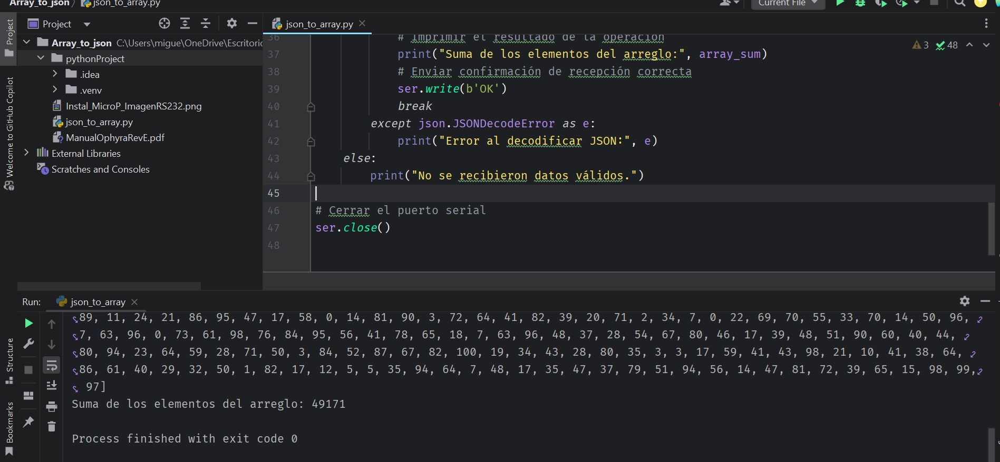
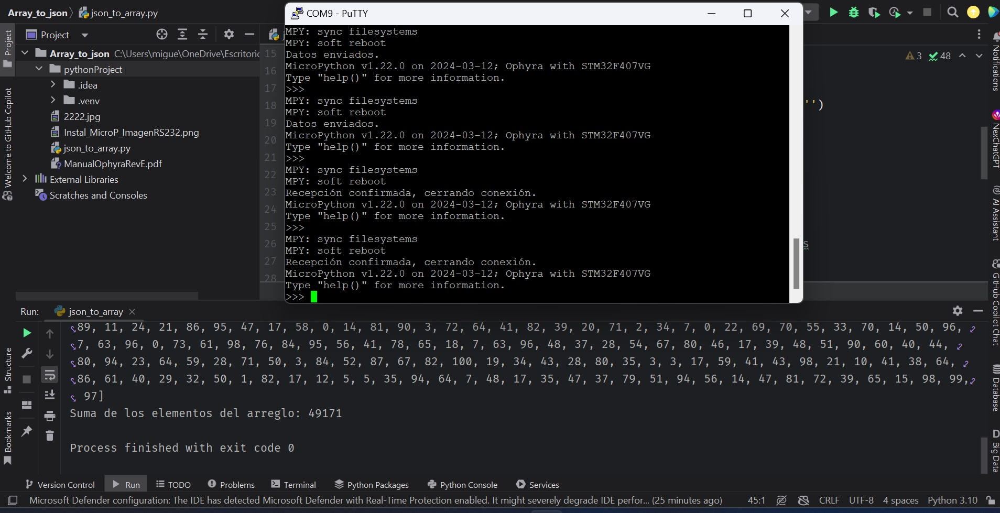

# MicroPython Serial Communication with Ophyra

## Description

This repository contains two main scripts that implement serial communication between an Ophyra development board and a computer. The objective is to send an array of data from the Ophyra board to the computer using UART and process the received data on the computer.

### Why JSON and Optimized Data Transmission?

JSON (JavaScript Object Notation) is a lightweight data interchange format that is easy for humans to read and write, and easy for machines to parse and generate. Using JSON for transmitting data over serial communication is beneficial due to its simplicity and ubiquity in data interchange formats.

**Importance of Data Integrity**

When transmitting data, especially in applications where the integrity of the data is crucial, ensuring the complete and accurate reconstruction of the data on the receiving end is vital. This repository demonstrates an optimized approach to sending and receiving data in JSON format, ensuring that the data remains intact during the transmission process.

### Optimization Strategies

1. **Chunked Data Transmission**: Instead of sending a large JSON string in one go, which might exceed the buffer capacity of the UART interface, the data is split into manageable chunks. This prevents data loss and ensures that each fragment is transmitted successfully.

2. **End Marker for Transmission**: An end marker (`END`) is used to signify the completion of the data transmission. This helps the receiver to know when the entire data set has been received and can begin processing.

3. **Acknowledgment Mechanism**: After receiving the complete data set, the receiver sends back an acknowledgment (`OK`) to confirm the successful reception. This ensures that the sender is aware of the successful transmission and can proceed accordingly.

## Files

1. **ophyra.py**: This script runs on the Ophyra development board. It creates an array of 1000 random data points, converts them to JSON format, and sends them via UART in manageable chunks. It includes an end marker to indicate the completion of data transmission and waits for an acknowledgment from the computer before closing the connection.

2. **json_to_array.py**: This script runs on the computer. It receives the JSON data from the Ophyra board via UART, decodes it into an array of integers, prints the array, and calculates the sum of its elements. It sends back an acknowledgment to confirm successful reception before closing the serial connection.

## Results

### Execution on the Computer

Below is a screenshot of the `json_to_array.py` script running on the computer. The script successfully receives the data array, prints it, and calculates the sum of its elements:



### Execution on the Ophyra Board

Below is a screenshot of the `ophyra.py` script running on the Ophyra board. The script sends the data and waits for a confirmation of successful reception before closing the connection:



## How to Use

### Requirements

- An Ophyra development board with MicroPython v1.22.0.
- A USB cable to connect the board to the computer.
- Python 3.x installed on the computer.
- The `pyserial` library installed on the computer (`pip install pyserial`).

### Instructions

1. **Repository Setup**

   Clone the repository and navigate to the project directory:

   ```sh
   git clone <REPOSITORY_URL>
   cd <REPOSITORY_NAME>
